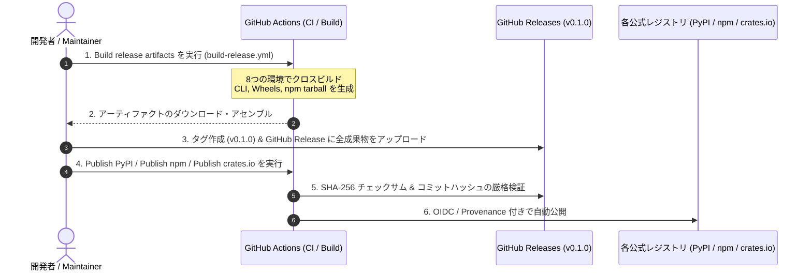

# パッケージ公開・リリース手順ガイド (PyPI / npm / crates.io)

本プロジェクト（`vba-insight` / `vba-retrace`）で開発したモジュールを、Python の公式リポジトリ **PyPI**、Node.js の公式レジストリ **npm**、Rust の **crates.io**、および **GitHub Packages** に公開するための詳細手順ガイドです。

---

## 1. 配布チャネルとパッケージ名

| チャネル | パッケージ名 | 配布形態・用途 |
|---|---|---|
| **PyPI** (Python) | `vba-insight` | Pre-built ABI3 binary wheels (`.whl`) および sdist (`.tar.gz`)。<br>`pip install vba-insight` でインストール（ユーザー環境での Rust コンパイル不要）。 |
| **npm** (Node.js) | `vba-insight` | N-API ネイティブアドオン。<br>`npm install vba-insight` で自動的に OS/CPU に応じたネイティブバイナリ（8 種の platform package）がダウンロード・配置される。 |
| **crates.io** (Rust) | `vba-insight` | Rust コアライブラリ（依存ゼロ・`std` のみ）および CLI バイナリ。<br>`cargo add vba-insight` または `cargo install vba-insight`。 |
| **GitHub Releases** | `vMAJOR.MINOR.PATCH` | CLI バイナリ（zip）、Wheel、npm tarball、ソース配布物、および `release-manifest.json` / `SHA256SUMS`。 |
| **GitHub Packages** | `@ryusui-hiro/vba-insight` | GitHub 内で認証付き利用が可能な npm パッケージのミラー。 |

> [!NOTE]
> 2026年9月現在、`vba-insight` の名前は **PyPI**、**npm**、**crates.io** のいずれにおいても未登録（404 Not Found）であり、利用可能な状態です。

---

## 2. 事前準備と認証設定（Trusted Publishing）

本リポジトリではセキュリティのベストプラクティスに基づき、長期間有効なパスワードや静的 API トークンをリポジトリ内に保持せず、GitHub Actions の OIDC（OpenID Connect）トークンを利用した **Trusted Publishing** に完全対応しています。

また、本リポジトリの GitHub 側には以下の保護されたデプロイ環境（Environments）が既に作成され、`main` ブランチからの実行に限定されています：
- `pypi`
- `npm`
- `crates-io`
- `github-packages`

### A. PyPI (Python) の設定手順
1. [PyPI](https://pypi.org/) にアカウントを作成・ログインします。
2. アカウントの **Account Settings** -> **Publishing** 画面へ移動します。
3. **"Add a pending publisher"** を選択し、以下を入力します：
   - **PyPI Project Name**: `vba-insight`
   - **Owner**: `ryusui-hiro`
   - **Repository name**: `vba-retrace`
   - **Workflow name**: `publish-pypi.yml`
   - **Environment name**: `pypi`
4. これにより、初回リリース実行時に GitHub Actions から OIDC 認証で自動的にパッケージが登録・公開されます（手動アップロード不要）。

### B. npm (Node.js) の設定手順
npm の Trusted Publishing（OIDC）は「既に存在するパッケージ」に設定する仕様となっているため、初回のみパッケージのブートストラップが必要です。

1. [npm](https://www.npmjs.com/) にアカウントを作成・ログインします。
2. **初回ブートストラップ（初回のみ）**:
   - 後述の「リリースビルド手順」で生成された `.tgz` ファイル群（ルートおよび各プラットフォーム用 8 パッケージ）をローカルで `npm login` の後、公開します：
     ```bash
     npm publish dist/release/vba-insight-0.1.0.tgz --access public
     # 各ネイティブプラットフォームパッケージも同様に公開
     ```
3. **Trusted Publisher の登録（初回公開後）**:
   - npm サイト上のパッケージの **Settings** -> **Publishing Access** -> **Trusted Publishers** を開きます。
   - GitHub Actions を選択し、リポジトリ `ryusui-hiro/vba-retrace`、ワークフロー `publish-npm.yml`、環境 `npm` を指定します。
   - 以降のリリースは GitHub Actions から OIDC で完全自動公開されます。

### C. crates.io (Rust) の設定手順
1. [crates.io](https://crates.io/) に GitHub アカウントでログインします。
2. 初回のみ、ローカルの Cargo 認証（`cargo login`）を用いて公開するか、または crates.io で API トークンを発行して GitHub Actions のシークレットに設定して公開します。

---

## 3. リリースおよび公開の実行フロー



### ステップ 1: リリースアーティファクトのビルド
`main` ブランチ上で **Build release artifacts** ワークフローを実行します：
```bash
gh workflow run build-release.yml --ref main
```
全 9 個のジョブ（`source` および 8 種のクロスコンパイル環境）が成功したことを確認します。

### ステップ 2: 成果物のダウンロードと整合性アセンブル
ビルドされたバイナリ群を 1 つのディレクトリに集約・検証します：
```bash
# 実行結果の RUN_ID を指定してダウンロード
gh run download <RUN_ID> --dir dist/downloaded

# release-artifacts.py でチェックサム付きリリースセットを構築
python3 scripts/release-artifacts.py assemble \
  --artifacts dist/downloaded \
  --output dist/release \
  --commit $(git rev-parse HEAD)
```
これにより `dist/release/` 配下に以下が自動生成されます：
- `release-manifest.json`（全ファイルの SHA-256 ハッシュとコミット情報）
- `SHA256SUMS`
- Python Wheels（Linux x64/arm64, macOS Intel/Silicon, Windows x64/arm64）
- Python sdist（`.tar.gz`）
- npm packages（ルート `vba-insight-0.1.0.tgz` および 8 つの platform tarball）
- CLI バイナリ（`.zip`）

### ステップ 3: GitHub Release の作成とアップロード
タグを打ち、GitHub Release を作成して成果物をアップロードします：
```bash
git tag v0.1.0
git push origin v0.1.0

gh release create v0.1.0 dist/release/* \
  --title "vba-insight v0.1.0" \
  --notes "Initial public release of vba-insight."
```

### ステップ 4: 各レジストリへの公開ワークフローの実行
GitHub Actions の各公開ワークフローを `workflow_dispatch` で実行します：

#### 1. PyPI へ公開
```bash
gh workflow run publish-pypi.yml -f tag=v0.1.0
```
- `scripts/fetch-pypi-release.py` が GitHub Release から Wheel と sdist を取得し、SHA-256 ハッシュとメタデータを検証した上で、PyPA 公式の Trusted Publisher アクション経由で PyPI へアップロードします。

#### 2. npm へ公開
```bash
gh workflow run publish-npm.yml -f tag=v0.1.0
```
- `scripts/publish-npm-release.py` が GitHub Release から各 tarball を取得し、ネイティブ依存パッケージからルートパッケージの順序で、`--provenance` フラグ付きで npm へ安全に公開します。

#### 3. crates.io へ公開
```bash
gh workflow run publish-crates.yml -f tag=v0.1.0
```
- または手元のクリーンな環境から `cargo publish -p vba-insight --locked` を実行します。

---

## 4. 公開後のインストール検証

各レジストリに公開されたパッケージは、以下のコマンドで誰でも利用可能になります：

### Python (PyPI)
```bash
pip install vba-insight
python -c "import vba_insight; print(vba_insight.__doc__)"
```

### Node.js / TypeScript (npm)
```bash
npm install vba-insight
node -e "const vba = require('vba-insight'); console.log(vba);"
```

### Rust (crates.io)
```bash
cargo add vba-insight
cargo install vba-insight --bin vba-insight
vba-insight --version
```
